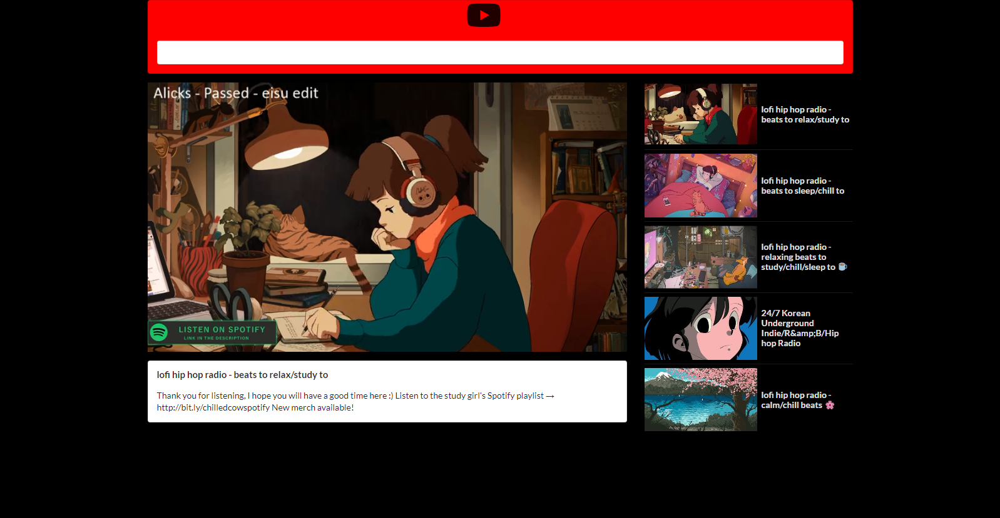

  
  
 

<h1 align="center"> Video Search App</h1>

<h2 align="center">  A React Project</h2>

## Deployment Link

[https://video-search-react-app.netlify.com](https://video-search-react-app.netlify.com)

## Intro

A React app that utilizes the Youtube data api to search for videos and watch them.

## Core Technologies

- React
- Semantic UI
- Youtube Data API
